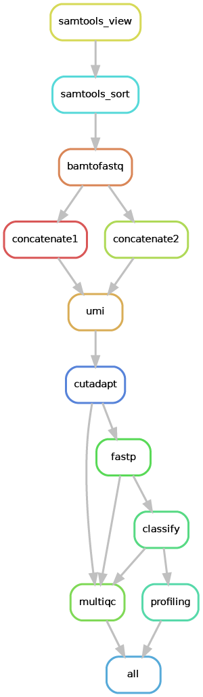

# *SpaceMicrobe* Snakemake workflow

## Description
The *SpaceMicrobe* Snakemake workflow is part of the *SpaceMicrobe* computational framework to detect microbial reads in 10X Visium Spatial Gene Expression data.

The Snakemake workflow requires that `spaceranger count` has already been run on the spatial transcriptomcics dataset. The input file required for the Snakemake workflow is the `possorted_genome_bam.bam` file from the spaceranger count `outs` folder.

The Snakemake workflow outputs the taxonomic classifications of the reads (a modified Kraken2 output file), that have to be further processed with the R package [microbiome10XVisium](https://github.com/bedapub/microbiome10XVisium).

## Graph
Overview of the Snakemake workflow: 

Reads that did not align to the host transcriptome/genome are extracted (samtools_view), the molecular (UMI) and spatial (10X barcode) information of the reads are preserved in read2 (umi) and quality control on read2 is performed (cutadapt and fastp), in order to remove adapters and poly-A tails, perform quality trimming and enforce a minimum read length. Then the metagenomic profiler Kraken2 is used to perform taxonomic classification of the reads (classify).



## Citation
TBD

## Table of contents
* [Quick Start](#quick-start)  
* [Installation](#installation)
* [Test Installation](#test-installation)	
* [Basic Usage](#basic-usage)	
* [pRED internal Usage](#pred-internal-usage)	
* [Main Output](#main-output)  	
* [Environment Creation with Mamba](#environment-creation-with-mamba)  


## Quick Start
### Installation

**Step 1 - Clone the repository**

First, clone the repository to the desired location on your system by using the following command:

```bash
git clone https://github.com/bedapub/space-microbe.git
```

**Step 2 - Install conda, if not already installed**

Next, ensure that conda is installed on your system, otherwise install using the instructions provided [here](https://developers.google.com/earth-engine/guides/python_install-conda/).

**Step 3 - Create and activate a new conda environment**

Then, create a new conda environment via the following command, replacing `/full/path/to/cloned/repo` with the appropriate path to your cloned repository:

```bash
conda env create -n space_microbe_env --file /full/path/to/cloned/repo/environment.yaml
```

And activate the environment by executing:

```bash
conda activate space_microbe_env
```

If you have trouble creating the environment using the above commands, you can alternatively follow the instructions [here](#environment-creation-with-mamba).

**Step 4 - Download Kraken database**

It is suggested to use the pre-built Kraken2 "Standard plus protozoa & fungi" database (PlusPF, 53Gb archive size) provided by Ben Langmead et al. 
See https://benlangmead.github.io/aws-indexes/k2

You can download the Kraken2 database to your desired location by using the following commands:

```bash
mkdir -p k2_pluspf_20230314 && cd k2_pluspf_20230314
wget https://genome-idx.s3.amazonaws.com/kraken/k2_pluspf_20230314.tar.gz
tar xvzf k2_pluspf_20230314.tar.gz
```

**Step 5 - Prepare input data**

All input data, i.e. the possorted_genome_bam.bam `BAM` files from the spaceranger count "outs"  output folder, must be located in local directories. The input data is pecified by a  _"file list"_.
The _"file list"_ is a tab-delimited text file and contains two columns: 
the first column denotes a sample alias (no white space, slash, etc. allowed) and the second column contains the realpaths to the corresponding `BAM` files.

Snakemake will read this "file list" and process the `BAM` files according to the workflow protocol.

Example file_list.txt
```
sampleA    /path/to/sampleA/possorted_genome_bam.bam
sampleB    /path/to/sampleB/possorted_genome_bam.bam
sampleC    /path/to/sampleC/possorted_genome_bam.bam
```


### Test Installation

In order to test that the Snakemake workflow can be run on your data, you can run the Snakemake workflow on a test dataset, that contains a downsized sample named CRC_16, from the Galeano Nino et al. (Nature 2022) publication. The test dataset is available in the directory `test_dataset` in your cloned repository. 

Navigate to your cloned repository using `cd`. Then, run the wrapper script `run.py` which will create a new `config.yaml` and launch the Snakemake workflow either locally (use `--cores <int>` option) or submitted to the cluster (use `--profile <path>` option). In the example below, Snakemake will be run locally and by using 4 cores for data processing. The filelist for the test_dataset has to be created with the realpath to the possorted_genome_bam.bam file.

```bash
conda activate space_microbe_env

python run.py --file-list <path to FILE_LIST> \
              --outdir <path to output folder> \
              --kraken-db <path to KRAKEN_DB> \
              --cores 4
```

### Basic Usage

For basic usage, first activate the conda environment and then run the wrapper script with the appropriate arguments, i.e. path to the input file list, output directory, path to kraken database, and use the optional parameters as required.

By the parameter `--profile <path>` the workflow will be submitted to the cluster, running up to `--jobs <int>` in parallel. However, if the option `--cores <int>` is used, the the workflow will be executed locally.

For the parameter `--kraken-threads` it is recommended to use 12 or 24 threads.  

```
conda activate space_microbe_env

python run.py --file-list <path to FILE_LIST> \
              --outdir <path to output folder> \
              --kraken-db <path to KRAKEN_DB> \
              [--kraken-threads KRAKEN_THREADS] \
              [--cores CORES] \
              [--jobs JOBS] \
              [--profile <path to configuration file for cluster PROFILE>]
```

The wrapper script has the following parameters:

```
python run.py --help

optional arguments:
  -h, --help            show this help message and exit
  --file-list FILE_LIST, -f FILE_LIST
                        Path to file list (tabular with Sample-ID and BAM-filepath)
  --outdir OUTDIR, -o OUTDIR
                        Path to output directory, may not exist
  --kraken-db KRAKEN_DB, -d KRAKEN_DB
                        Path to the Kraken database
  --kraken-threads KRAKEN_THREADS, -k KRAKEN_THREADS
                        Number of cores to use for the Kraken classification step
  --cores CORES, -c CORES
                        Number of cores to use for local run
  --jobs JOBS, -j JOBS  Number of jobs for running on the cluster
  --profile PROFILE, -p PROFILE
                        Path to cluster profile, if omitted Snakemake will be run locally
```                        

### pRED internal Usage

For users within pRED, a conda environment has been created and the Kraken2 database is already downloaded. Users only have to edit the config.yaml file with the path to their filelist in `file_list` and the desired output directory in `results`. An example config.yaml file is provided below.

Example config.yaml file:
```
file_list: 'test_filelist.txt'                                    		     # Path to file list (tabular with Sample-ID and BAM-filepath)
results: 'output'                                                                    # Path to output directory, may not exist
kraken_threads: 12                                                                   # Number of cores to use for the Kraken classification step
kraken_db: '/projects/site/pred/ngs/pipelines/st_microbiome/kraken2_Standard_PlusPF' # Path to the Kraken database
```

Navigate to your cloned repository using `cd`. The Snakemake worklow can then be run on the sHPC in the following way:
```
ml purge && ml Anaconda3 && conda activate /projects/site/pred/ngs/envs/st_microbiome

bash run_hpc.sh config.yaml
```

### Main Output

The Snakemake workflow produces an output directory specified in `--outdir`. The output directory contains multiple subdirectories.

One of the subdirectories is the `multiqc_QC` directory, containing a `multiqc_report.html` - a MultiQC report for the QC steps (fastp and cutadapt) and the taxonomic classification with Kraken2. 

The other subdirectories are one directory for every sample specified in the file list, named by the sample ID specified in the file list. These subdirectories contain multiple output files for every sample:
* `SAMPLE_ID_profiling-output.txt`: a tab-separated txt file with the spatial (BC), molecular (BC) and taxonomic (taxID) information for every read. This is the input file required for the `microbiome10XVisium` R package.
* `SAMPLE_ID_trim.fq.gz`: the quality_controlled fastq file for read2
* `SAMPLE_ID_kraken-output.txt` and `SAMPLE_ID_kraken-report.txt`: the original Kraken2 output and report files, which can be used for further processing with [KrakenTools] (see https://github.com/jenniferlu717/KrakenTools).

### Environment Creation with Mamba

This method may be quicker than the one described above. Here we create the conda environment with `mamba` and without the provided `environment.yml` file. At the end, we use `conda-minify` to create a new `environment.yml` file.

```bash
DIR=/path/to/your/preferred/destination/folder/space_microbe_env

conda create -y -f -p $DIR -c conda-forge python=3.9 mamba
conda activate $DIR
mamba install -c bioconda -c conda-forge -c jamespreed -y conda-minify snakemake samtools multiqc cutadapt umi_tools 10x_bamtofastq fastp kraken2

conda-minify --name $DIR -f environment.yml 
```

